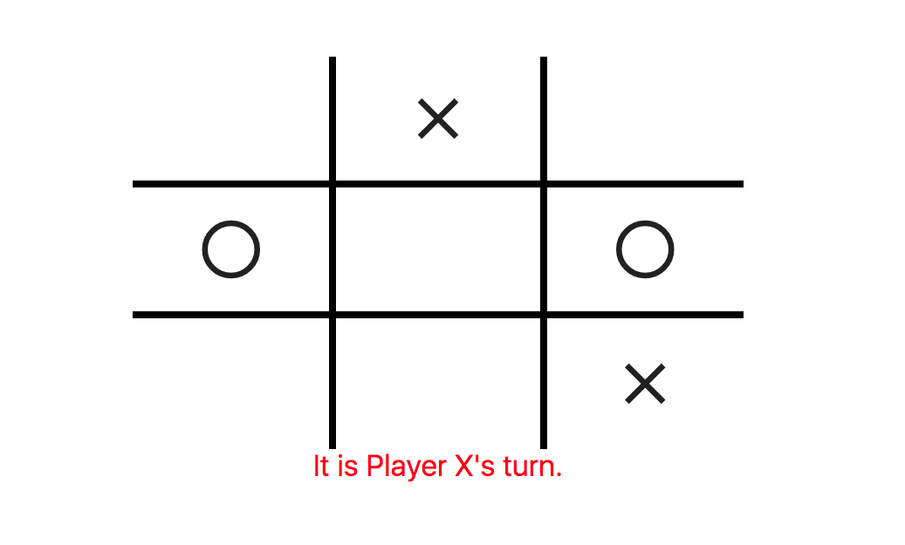

# Tic Tac Toe (With Tests in Jest)

> Tic Tac Toe Game using JavaScript

This app is implementation of Tic Tac Toe using Vanilla JS and testing using jest (built by [@mcrd25](https://github.com/mcrd25))

## Built With

- JavaScript (ES6)
- jest
- npm
- eslint

## Live Demo

[Live Demo Link](https://rawcdn.githack.com/mcrd25/tic-tac-toe-js/eba28be9095b34751c24389bd20534417abcbb67/index.html)

## Getting Started

To get a local copy up and running follow these simple example steps.

### Prerequisites
You will need to have a recent version of [Node.js](https://nodejs.org/en/)

### Setup
run `cd tic-tac-toe-js`
### Install
run `npm install`
### Usage
run `npm start` to launch app in development mode  
run `npm build` to build app for production
run `npm dev`

### Run tests
run following command `npm test` or `jest`

### Deployment
Run `npm build` and add resulting files in `dist` folder desired server or simply open **index.html** in local environment
If you'd simply like to run in webpack dev server you can run `npm start`

## Authors

👤 **Maya Douglas**

- Github: [@mrd225](https://github.com/mcrd25)
- Twitter: [@mcrd25](https://twitter.com/twitterhandle)
- Linkedin: [linkedin](https://www.linkedin.com/in/mayadouglas/)

👤 **Adriaan Beiertz**

- Github: [@adriaanbd](https://github.com/githubhandle)

## 🤝 Contributing

Contributions, issues and feature requests are welcome!

Feel free to check the [issues page](issues/).

## Show your support

Give a ⭐️ if you like this project!

## 📝 License

This project is [MIT](LICENSE) licensed.
